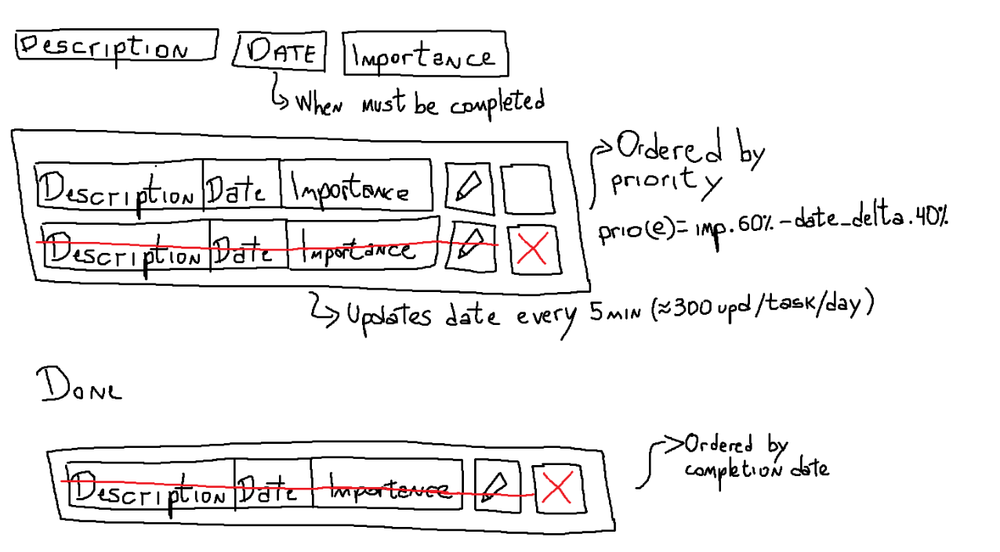

todo list idea -> 

we only need to show description, date, is_done (the importance will be taken into consideration when calculating the priority)

the list should self update based on the date importance
